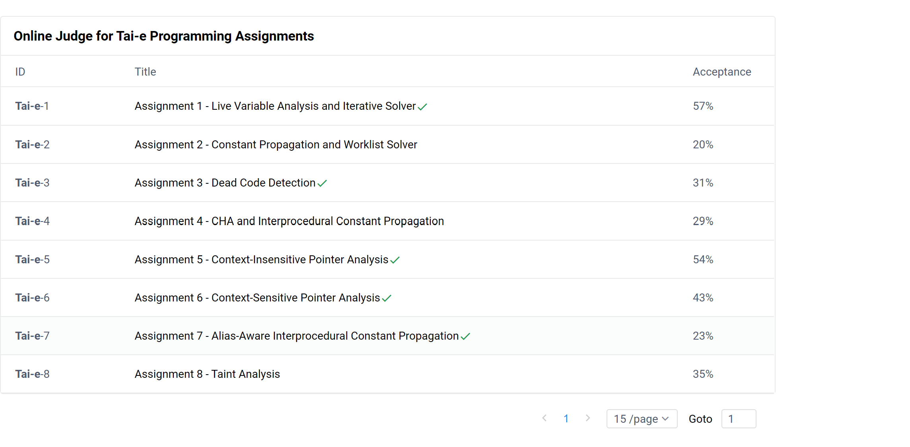

  

## Tai-e Assignments for Static Program Analysis

### Getting Started

If you want to do the assignments, please start with "*Overview of Tai-e
Assignments*" [[中文](https://tai-e.pascal-lab.net/intro/overview.html)][[English](https://tai-e.pascal-lab.net/en/intro/overview.html)].

### Write-up

#### A1

+ 活跃变量分析(Iterative approach)
+ 后向分析(backward analysis)

#### A2

+ 常量传播(work-list approach)
+ 前向分析(forward analysis)
+ meet 的规则比较特殊，不是通常的集合操作，但依然保证了分析的单调性

#### A3

+ 死代码检测（结合常量传播和活跃变量分析）
+ 图的遍历
+ 控制流不可达：利用常量传播地结果来分析分支是否可达以及switch语句跳转的目标
+ 无用复制：如果赋值给一个非活跃变量，则该赋值无效，也属于死代码

#### A4

+ Class Hierarchy Analysis和 call graph的建立
+ CHA 主要根据变量的声明类型，找到所有可能的调用(resolve and dispatch)
+ 根据调用点建立出函数的call graph

#### A5

+ 上下文不敏感的指针分析(context-insensitive)
+ 需要将new object加入到work list当中，否则新object无法传播下去

#### A6

+ 上下文敏感的指针分析(context-sensitive)
+ 2-type 方法的构建新的上下文的时候基于obj的context，而不是call site的context
+ 2-type & 2-obj & 2-call 需要限制heap context的数量为1

#### A7

+ 过程间常量传播分析(alias-aware)
+ array的index变化时，需要将相应的`LoadArray`放进work list当中
+ `StoreArray` 和 `StoreField`的右值发生变化的时候，需要将相应的`LoadArray`和`LoadField`加入work list当中

#### A8

+ Taint Analysis
+ Method 有可能解析不出来返回 null
+ sink指定了方法和参数的位置
+ 使用正确的上下文，参数应该使用caller的上下文而非callee的上下文
+ 同一个方法可能有多个transfer规则，需要正确处理

#### Accepted Test

[PASCAL OJ](https://oj.pascal-lab.net/problem)

+ A1
+ A3
+ A5
+ A6
+ A7

The other 3 tests failed on some hidden test cases and a vast majority of test cases are passed though.

> I really appreciate the impressive work done by the PASCAL team, and it helps me a lot. Thank you!
